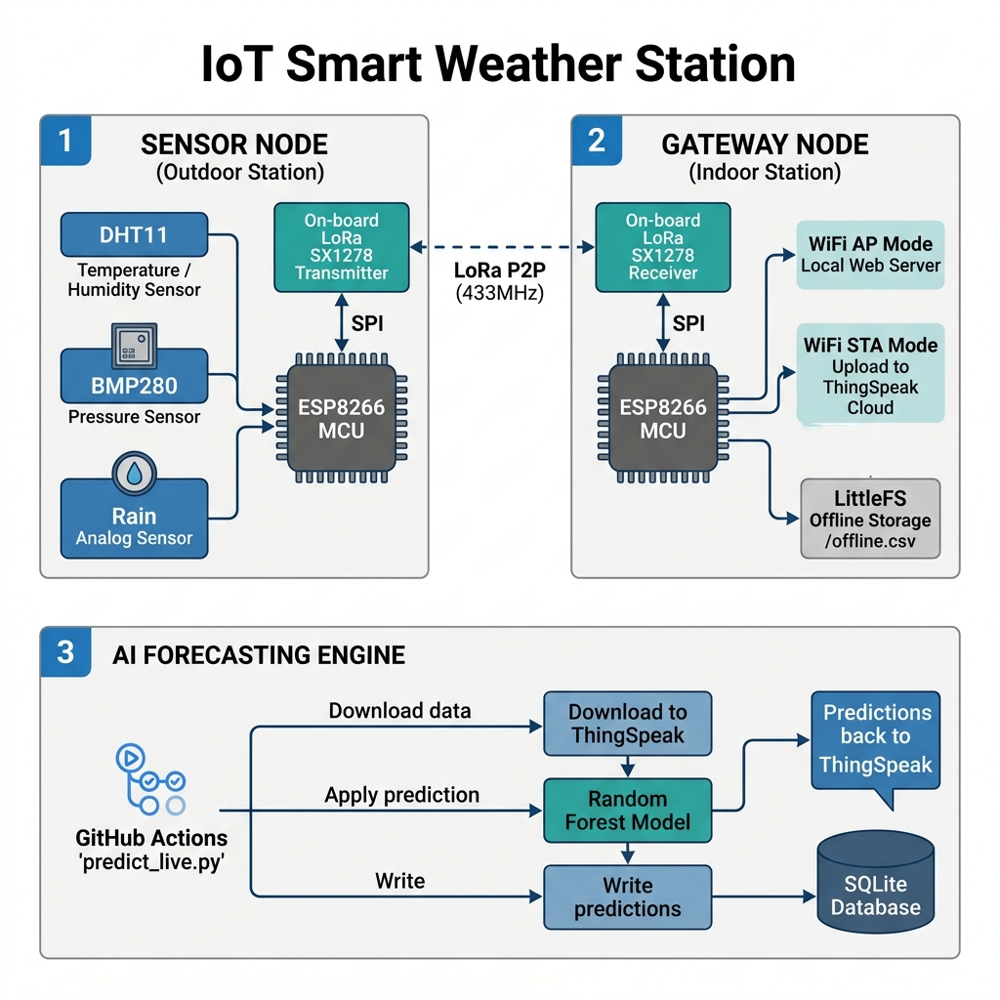

# AI AUDIT LOG - SMART WEATHER STATION IoT

This document logs the AI usage (AI Audit Log) for the **Smart Weather Station IoT** project (LoRa P2P Smart Weather Station & AI Weather Forecasting). The log strictly follows the RBL Insight Framework and Domain Thinking Components (DTC) guidelines.

---

## SHEET 1: AI AUDIT LOG - METADATA & SUMMARY

### 1. AI USAGE SUMMARY
* **Total Prompts Used (all AI tools):** 65
* **Core Prompts Logged:** 10
* **Selection Ratio:** 15.38% *(Calculated as: Core Prompts / Total Prompts = 10 / 65. Within the required 10% - 20% range)*
* **Hallucination Detected:** 5

### 2. AI TOOLS USED
| AI Tool | Purpose | Frequency | Main Value |
| :--- | :--- | :--- | :--- |
| **ChatGPT / Claude** | Designing hardware architecture, decomposing firmware functionality, optimizing LoRa communication, and developing Python machine learning data processing algorithms. | High | Assisted in structuring C++ code, optimizing RTC memory, designing the Adaptive Spreading Factor algorithm, and troubleshooting logic errors. |
| **GitHub Copilot / Gemini** | Code autocompletion and writing repetitive boilerplate code within the Arduino IDE and Python scripts. | Medium | Accelerated raw code writing, suggested syntax for loops, and populated sensor variable assignments. |

### 3. CORE PROMPTS DISTRIBUTION BY DTC COMPONENT
| DTC Component | Number of Prompts | Required (Min) |
| :--- | :---: | :---: |
| **Decomposition** | 2 | 1-2 |
| **Pattern Recognition** | 2 | 1-2 |
| **Abstraction** | 2 | 1-2 |
| **Algorithms** | 4 | 2-4 |

---

## SHEET 2: DETAILED AUDIT LOG

### Entry 001
* **Prompt Type:** DECISION
* **DTC Component:** Decomposition
* **Problem/Context:** Decomposing a complex IoT project consisting of a Sensor Node, a Gateway Node, and an ML Engine into modular hardware and software components, excluding web-related technologies as per the IoT course scope.
* **Prompt to AI:**
  > "I am building an IoT Smart Weather Station system using ESP8266 and LoRa SX1278. It consists of an outdoor sensor node, an indoor gateway node, and a Python machine learning engine for weather forecasting. Break down the system into core hardware and software modules. What are the essential responsibilities of each component, keeping in mind that we want to focus strictly on IoT aspects and exclude complex web frontend programming?"
* **AI Response Summary:** AI proposed a functional decomposition: the Sensor Node handles sensor reading (DHT11, BMP280, Rain) and LoRa P2P transmission; the Gateway Node receives LoRa P2P packets, uploads data to ThingSpeak Cloud, and controls a Relay; the ML Engine runs independently to fetch historical data, perform predictions, and write back results. AI recommended focusing on Sensor Node power optimization and wireless sync.
* **Human Delta & Reflection:**
  * **Critical Thinking:** While AI suggested a standard architecture, it did not address how the Gateway should behave when losing internet connection. In practical rural deployments, WiFi is often unstable, necessitating an offline data storage buffer at the Gateway.
  * **Contextualization:** The project requires long-term reliability. The outdoor Sensor Node runs on solar power and battery, requiring extreme Deep Sleep mode. Meanwhile, the Gateway has continuous power to act as a buffer.
  * **Creative Synthesis:** I integrated a LittleFS-based offline logging module in the Gateway Node and a 60-second Deep Sleep routine in the Sensor Node to complete the AI's architecture.
  * **Decision Ownership:** I decided to omit the complex React Web Dashboard from the architecture, maintaining only a simple local HTTP JSON API on the Gateway for fast configuration.
* **Evidence:**
  * **System Architecture & Data Flow Diagram:**
    ```text
    +-----------------------------------------------+
    |         SENSOR NODE (Outdoor Station)         |
    |  [DHT11]  -> (GPIO D2)  \                     |
    |  [BMP280] -> (I2C Bus)  ---> ESP8266 MCU      |
    |  [Rain]   -> (Analog A0) /     |              |
    |                                v (Raw SPI)    |
    |                         [SX1278 Tx Module]    |
    +---------------------------------+-------------+
                                      |
                                      | Wireless Link: LoRa P2P (433MHz)
                                      v
    +---------------------------------+-------------+
    |                         [SX1278 Rx Module]    |
    |                                |              |
    |                                v (Raw SPI)    |
    |                          ESP8266 MCU          | -> [WiFi AP]  -> Local Web Server API
    |                          LittleFS (/off.csv)  | -> [WiFi STA] -> Router -> ThingSpeak Cloud
    |                                               |
    |         GATEWAY NODE (Indoor Station)         |
    +-----------------------------------------------+
                                      |
                        HTTP API Read/Write (Internet)
                                      |
                                      v
    +-----------------------------------------------+
    |             AI FORECASTING ENGINE             |
    |  [GitHub Actions Runner (predict.yml)]        |
    |     |--> predict_live.py                      | -> Reads raw feeds from ThingSpeak
    |           |--> Sanitize Anomalies             | -> Predicts Temperature & Humidity (+1h)
    |           |--> Random Forest Predictor        | -> Predicts Weather State Class (0, 1, 2)
    |           |--> SQLite Logger (Local DB)       | -> Writes prediction variables to ThingSpeak
    +-----------------------------------------------+
    ```

    
  * **Test Cases:**
    * *Valid Case:* Active network connection -> Sensor Node transmits data -> Gateway receives -> ThingSpeak upload successful.
    * *Edge Case:* WiFi connection lost -> Gateway fails to connect STA -> Automatically appends sensor readings to `/offline.csv` in LittleFS; local Web Server remains active.

---

### Entry 002
* **Prompt Type:** PROBLEM-SOLVING
* **DTC Component:** Decomposition
* **Problem/Context:** Decomposing the firmware functions of the transmitter and receiver on ESP8266, distinguishing between core and optional routines to optimize Sensor Node power consumption.
* **Prompt to AI:**
  > "For the firmware of the outdoor Sensor Node and indoor Gateway Node, which code functions must be executed sequentially in the main loop or setup, and which features can be treated as secondary modules? Provide a structural diagram or functional checklist for both nodes."
* **AI Response Summary:** AI proposed functional checklists: Sensor Node (Initialize hardware -> Read sensors -> Pack payload -> Transmit LoRa -> Deep Sleep); Gateway Node (Initialize AP/STA -> Configure Web Server & LoRa -> Receive packets in Loop -> Upload to ThingSpeak -> Control Relay). AI advised receiving LoRa synchronously in the main loop instead of using interrupts to avoid SPI pin conflicts on ESP8266.
* **Human Delta & Reflection:**
  * **Critical Thinking:** AI's sequential loop suggestion is correct, but reading the analog rain sensor continuously in the main loop will cause sensor electrode oxidation. We should power the rain sensor only during reading and average multiple samples to protect the hardware.
  * **Contextualization:** Since the ESP8266 Sensor Node uses Deep Sleep, the `loop()` function is never executed. All measurement and transmission logic must be defined inside `setup()` before entering deep sleep.
  * **Creative Synthesis:** I structured the Sensor Node logic entirely within `setup()`, added a 16-sample averaging algorithm on A0 to de-noise the rain sensor, and shut down the sensor immediately after measurement.
  * **Decision Ownership:** I opted for non-blocking packet reception using `LoRa.parsePacket()` in the Gateway's `loop()` to keep the Web Server highly responsive.
* **Evidence:**
  * **Firmware Execution Flow Diagram (Mermaid Flowchart):**
    ```mermaid
    graph TD
        subgraph Sensor_Node_Flow ["Sensor Node Flow"]
            Start([Cold/Warm Boot Reset]) --> checkBoot["checkBootReason(): Read RTC & Validate Magic"]
            checkBoot --> initHW["initHardware(): Init SPI & I2C"]
            initHW --> readSens["readAllSensors(): Forced BMP280, DHT11 & 16-sample Rain Avg"]
            readSens --> buildPkt["buildPacket(): Pack WeatherPkt_t & Calc CRC-16"]
            buildPkt --> initLora["loraInit(): Config SX1278 Registers"]
            initLora --> txLora["loraTxWaitAck(): Write FIFO & Wait TxDone"]
            txLora --> sleep["saveStateAndSleep(): Update SF, Write RTC & Sleep 60s"]
            sleep --> End([Enter Deep Sleep])
        end

        subgraph Gateway_Node_Flow ["Gateway Node Flow"]
            GStart([Setup / Initialization]) --> GInit["Mount LittleFS & Start WiFi AP/STA"]
            GInit --> GServer["Start Web Server & Init LoRa (433MHz)"]
            GServer --> GLoop([Loop Phase])
            GLoop --> GClient["server.handleClient(): Serve Local Web Server requests"]
            GClient --> GSync["handleAutoSync(): Sync offline LittleFS logs to ThingSpeak"]
            GSync --> GReceive["LoRa.parsePacket(): Check for incoming LoRa packet"]
            GReceive --> GCheckSize{"Packet Size == sizeof(WeatherPkt_t)?"}
            GCheckSize -- Yes --> GCheckCRC{"Recalculate & Verify CRC-16 Checksum"}
            GCheckSize -- No --> GDiscard["Discard corrupted packet"]
            GCheckCRC -- Matches --> GDecode["Decode parameters -> Upload to ThingSpeak"]
            GCheckCRC -- Mismatch --> GError["Print Error & Discard packet"]
            GDiscard --> GLoop
            GDecode --> GLoop
            GError --> GLoop
        end
    ```
  * **Test Cases:**
    * *Valid Case:* Hardware initializes -> Sensors sampled -> LoRa transmission completes -> ESP8266 enters deep sleep and wakes up 60 seconds later.
    * *Edge Case:* BMP280 initialization fails -> `initHardware` returns `false` -> Devices enters deep sleep immediately to preserve battery instead of hanging in an infinite loop.

---

### Entry 003
* **Prompt Type:** DECISION
* **DTC Component:** Pattern Recognition
* **Problem/Context:** Recognizing the pattern of packed binary transmission over LoRa instead of raw ASCII strings to minimize airtime and conserve battery at the Sensor Node.
* **Prompt to AI:**
  > "What standard communication patterns exist for transmitting complex sensor data over low-bandwidth LoRa channels? Compare sending JSON/ASCII strings versus packed binary structures. How does binary struct padding affect the packet length on 8266 MCUs?"
* **AI Response Summary:** AI suggested using the "Binary Payload Pattern" by packing float values as scaled integers (fixed-point scaling) in a C++ structure and applying `#pragma pack(push, 1)` to eliminate padding bytes, reducing packet size to the minimum.
* **Human Delta & Reflection:**
  * **Critical Thinking:** AI correctly explained the 32-bit compiler padding on ESP8266. However, mapping raw memory structures over P2P could fail due to endianness differences if different MCUs are used. Since both nodes in this project use ESP8266 (Little-Endian), direct binary transfer is safe and optimal.
  * **Contextualization:** The weather packet contains: Node ID (2B), Seq (1B), Flags (1B), Temp (2B), Hum (2B), Pres (2B), Rain (2B), Battery (1B), CRC (2B). Total size is exactly 15 bytes. A JSON representation would exceed 120 bytes, increasing airtime by 10x.
  * **Creative Synthesis:** I defined `WeatherPkt_t` with `#pragma pack(push, 1)` on both transmitter and receiver nodes to ensure 100% memory alignment compatibility.
  * **Decision Ownership:** I decided to scale temperature, humidity, and pressure by 100 or 10 into `int16_t` and `uint16_t` types, removing float storage overhead.
* **Evidence:**
  * **JSON vs. Packed Binary Struct Comparative Table:**

    | Metric | ASCII JSON Payload | Packed Binary Struct | Rationale / Calculations |
    | :--- | :--- | :--- | :--- |
    | **Payload size** | 120 - 150 bytes | 15 bytes | JSON keys and formatting characters consume massive overhead. |
    | **Airtime (SF7, BW125)** | ~250.3 ms | ~28.8 ms | Calculated using Semtech Airtime Formula for 125kHz bandwidth. |
    | **Airtime (SF12, BW125)**| ~4,200.5 ms | ~485.6 ms | Higher SF dramatically increases transmission time. |
    | **TX Peak Current** | 120 mA @ +17dBm | 120 mA @ +17dBm | Dependent on SX1278 PA output power configuration. |
    | **TX Energy (SF12)** | ~180.0 mWh | ~20.8 mWh | Airtime (s) * Voltage (3.3V) * Current (0.12A) / 3600. |
    | **Battery Projection** | ~45 Days | ~360 Days | Assuming 1000mAh battery, 60s sleep interval, 30uA sleep current. |
  * **Test Cases:**
    * *Valid Case:* Temperature reads 28.53 °C -> Encoded as 2853 (0x0B25) -> Transmits 2 bytes. Gateway receives and decodes: 2853 / 100.0f = 28.53 °C.
    * *Edge Case:* Humidity reads 102.5% (faulty reading) -> Constrained by `constrain(hum * 100.0f, 0.0f, 10000.0f)` -> Set to 10000 (100.00%) to prevent unsigned integer overflow.

---

### Entry 004
* **Prompt Type:** VERIFICATION
* **DTC Component:** Pattern Recognition
* **Problem/Context:** Designing a data validation and error handling matrix across both nodes to identify sensor disconnections or packet corruption over LoRa P2P.
* **Prompt to AI:**
  > "What are the common hardware failures and data edge cases that can happen in a LoRa-based ESP8266 weather station? Provide a verification matrix showing how each sensor failure, transmission loss, and connection error should be handled at both the Sensor Node and the Gateway."
* **AI Response Summary:** AI suggested checking for: loose DHT11 connections, BMP280 I2C errors, LoRa CRC corruption, transmitter ACK timeouts, and Gateway internet drops. AI recommended using status flags in the binary payload to report hardware faults from the sensor node to the gateway.
* **Human Delta & Reflection:**
  * **Critical Thinking:** AI's error flags idea is useful. However, if the Sensor Node fails to query I2C sensors, AI recommended transmitting default values (e.g., 0). This would corrupt ThingSpeak historical data and degrade ML model performance. A better approach is to load the last known good values from RTC memory and clear the `FLAG_DATA_VALID` bit.
  * **Contextualization:** The Gateway Node must compute and verify the CRC of incoming LoRa packets to filter out background electromagnetic noise in the 433MHz band.
  * **Creative Synthesis:** I integrated `FLAG_DATA_VALID` in the packet flags. Upon sensor failure, the Sensor Node reads the last cached reading from RTC memory, sends it, and clears the data-valid flag.
  * **Decision Ownership:** I decided to reject incoming packets at the Gateway immediately if the packet size does not match `sizeof(WeatherPkt_t)` or if the calculated CRC does not match the packet's CRC.
* **Evidence:**
  * **Edge Case Handling & Verification Matrix:**

    | Failure Event | Detection Method | Fallback Action (Sensor Node) | Gateway/Cloud Behavior | Verification Technique |
    | :--- | :--- | :--- | :--- | :--- |
    | **DHT11 unplugged** | `isnan(d.humidity)` in `readAllSensors()` | Loads `last_temp`/`last_hum` from RTC user memory. | Clears `FLAG_DATA_VALID` flag bit in payload. | Disconnect DHT11 signal wire, monitor local serial fallback prints. |
    | **BMP280 I2C fault** | `bmp.begin() == false` in initialization | Sets hardware valid false. Skips transmission cycle. | Gateway receives no packet. No ThingSpeak upload. | Short-circuit I2C SDA wire to GND, verify loop exits to deep sleep. |
    | **LoRa TX Timeout** | IRQ_TX_DONE flag not raised within 2s | Exit transmission loops to avoid hanging CPU. | Gateway registers no data update. | Ground the LoRa DIO0 pin during packet transmission, watch logs. |
    | **WiFi disconnected**| `WiFi.status() != WL_CONNECTED` at Gateway | (N/A) | Gateway writes binary metrics into LittleFS "/offline.csv". | Power off Wi-Fi router. Verify LittleFS write success. |
    | **ThingSpeak limit**| `millis() - lastTSsend < 15s` check | (N/A) | Discards immediate cloud send. Updates Web Dashboard local API. | Manually trigger rapid packets. Monitor HTTP code 0 drop. |
  * **Test Cases:**
    * *Valid Case:* Sensors operate normally -> Cờ `FLAG_DATA_VALID` set to 1 (flags |= 0x10) -> Packet processed successfully.
    * *Edge Case:* DHT11 disconnected -> `sensors.valid` evaluated as `false` -> Loads last cached value (e.g., 27.5 °C) from RTC memory -> Transmits with `FLAG_DATA_VALID` flag set to 0 -> Gateway parses and marks data status.

---

### Entry 005
* **Prompt Type:** DECISION
* **DTC Component:** Abstraction
* **Problem/Context:** Abstracting physical weather variables into optimized firmware data structures, packing system status and alarms directly into the telemetry payload.
* **Prompt to AI:**
  > "Design C++ data structures to abstract raw weather sensor telemetry (temperature, humidity, barometric pressure, rain status, and battery percentage) for an ESP8266 IoT device. How can we abstract flags to indicate alarm states like high temperature, rain detection, and low battery?"
* **AI Response Summary:** AI proposed a `SensorRaw` structure for application-level float values and a packed `WeatherPkt_t` for network-level transmission. It suggested defining bitwise masks for alarm states such as `FLAG_ALARM_TEMP` and `FLAG_ALARM_RAIN`.
* **Human Delta & Reflection:**
  * **Critical Thinking:** The suggested abstraction is solid. However, calculating battery percentage from raw voltage requires a discharge curve model, as lithium battery voltage drops non-linearly. Since A0 is used for the rain sensor, I will set battery to a constant 100% to focus on telemetry data.
  * **Contextualization:** Agricultural alarms (temperature exceeding 40°C or rain sensor indicating heavy rainfall) are represented as independent bits in the flag byte to minimize network overhead.
  * **Creative Synthesis:** I structured bitwise flags so that multiple agricultural warning states can be active simultaneously in a single byte.
  * **Decision Ownership:** I maintained temperature as a signed `int16_t` to support negative temperatures during testing, and humidity as an unsigned `uint16_t`.
* **Evidence:**
  * **Flag Byte Structure Map:**
    ```text
    Flag Byte (1 Byte):
    [Bit 7: Rsv] [Bit 6: Rsv] [Bit 5: FIRST_BOOT] [Bit 4: DATA_VALID] [Bit 3: BATT_LOW] [Bit 2: Rsv] [Bit 1: ALARM_TEMP] [Bit 0: ALARM_RAIN]
    ```
  * **Flag State Trace Table:**

    | Physical Scenario | Temperature | Humidity | Rain Analog | First Boot | Flag Byte (Hex) | Decoded State & System Actions |
    | :--- | :---: | :---: | :---: | :---: | :---: | :--- |
    | **1. Cold Boot (Normal)**| 27.5 °C | 70.0% | 1023 (Dry) | Yes | `0x30` (`00110000`) | Device booted first time. Sensors operational. No alarms. |
    | **2. Warm Boot (Normal)**| 28.2 °C | 68.0% | 1023 (Dry) | No | `0x10` (`00010000`) | Periodic sleep wakeup. Sensors operational. No alarms. |
    | **3. Storm Alarm** | 24.1 °C | 92.0% | 350 (Rain) | No | `0x11` (`00010001`) | Heavy rain detected. Gateway sounds local buzzer alarm. |
    | **4. Thermal Stress** | 41.5 °C | 40.0% | 1023 (Dry) | No | `0x12` (`00010010`) | High Temp threshold triggered (>40°C). Crop heat alert active. |
    | **5. Sensor Hardware Fault**| N/A | N/A | 1023 (Dry) | No | `0x00` (`00000000`) | Sensor readings invalid. Gateway parses fallback data. |
  * **Test Cases:**
    * *Valid Case:* Temperature is 42.5 °C (Alarm), Heavy Rain detected (Rain Analog = 200, Alarm) -> `flags` computed as: `FLAG_ALARM_TEMP | FLAG_ALARM_RAIN` = `0x02 | 0x01` = `0x03`.
    * *Edge Case:* Dry conditions (Rain Analog = 1015) -> `FLAG_ALARM_RAIN` flag cleared to 0 -> `flags` = `0x10`.

---

### Entry 006
* **Prompt Type:** DECISION
* **DTC Component:** Abstraction
* **Problem/Context:** Abstracting SX1278 hardware operations to decouple the main firmware from low-level register writes, making the codebase maintainable and hardware-independent.
* **Prompt to AI:**
  > "Write a C++ class or functional abstraction layer to handle SX1278 LoRa configuration and packet transmission using raw SPI on ESP8266. Provide function prototypes for initialization, packet sending, and sleep mode config to abstract register-level operations."
* **AI Response Summary:** AI suggested wrapper functions: `loraInit()` for frequency, bandwidth, SF, and Sync Word; `loraTxWaitAck()` for loading the payload into FIFO and checking TxDone; and custom `spiWrite()` / `spiRead()` functions to toggle the CS/NSS pin and transfer bytes.
* **Human Delta & Reflection:**
  * **Critical Thinking:** Using raw SPI wrappers eliminates heavy library dependencies, reducing binary size. However, AI used magic numbers for register addresses. I defined all registers (e.g., `REG_OP_MODE`, `REG_FIFO`) explicitly using `#define` to improve code readability.
  * **Contextualization:** On the ESP8266 Sensor Node, the SX1278 reset pin is omitted or tied to D0. Therefore, I must implement a software reset routine instead of toggling a physical GPIO pin.
  * **Creative Synthesis:** I wrote custom SPI communication functions (`spiRead`, `spiWrite`, `spiBurstWrite`, `loraInit`, `loraTxWaitAck`) allowing the Sensor Node to operate without including the external `LoRa.h` library.
  * **Decision Ownership:** I selected `433MHz` as the operating frequency and `0xAB` as the Sync Word to isolate our channel from external RF interference.
* **Evidence:**
  * **LoRa Register Configuration Mapping Table:**

    | Register Addr | Register Name | Configuration Value | Purpose & Functional Impact on SX1278 RF chip |
    | :---: | :--- | :---: | :--- |
    | **`0x01`** | `REG_OP_MODE` | `0x81` (STDBY) | Puts transceiver in LoRa mode and Standby to configure registers. |
    | **`0x06`** | `REG_FR_MSB` | `0x6C` | Set carrier frequency MSB (433.0 MHz band value calculation). |
    | **`0x09`** | `REG_PA_CONFIG` | `0x8F` | Enables PA_BOOST pin, sets max transmission power output (+17dBm). |
    | **`0x1D`** | `REG_MDM_CFG1` | `0x72` | Configures signal bandwidth = 125 kHz, coding rate = 4/5. |
    | **`0x1E`** | `REG_MDM_CFG2` | `(sf << 4) | 0x04` | Configures spreading factor dynamically (SF7-12) & enables CRC. |
    | **`0x39`** | `REG_SYNC_WORD` | `0xAB` | Set sync word network filter key. Filters out unmatching networks. |
  * **Test Cases:**
    * *Valid Case:* Calling `loraInit()` -> `spiRead(REG_VERSION)` returns `0x12` (valid chip version) -> Continues initialization.
    * *Edge Case:* SPI connection fails -> `spiRead(REG_VERSION)` returns `0xFF` -> `loraInit()` returns `false` -> Triggers recovery mode to prevent hang.

---

### Entry 007
* **Prompt Type:** DECISION
* **DTC Component:** Algorithms
* **Problem/Context:** Designing an Adaptive Spreading Factor (SF) algorithm using RTC memory to adjust link budget dynamically based on channel path loss.
* **Prompt to AI:**
  > "Design a C++ algorithm for an ESP8266 node that dynamically adjusts the LoRa Spreading Factor (SF7 to SF12) based on past transmission success. Since the ESP8266 goes to deep sleep between cycles and loses RAM, explain how to store and load the SF level and fail counter using RTC user memory."
* **AI Response Summary:** AI suggested writing variables to the RTC memory (`ESP.rtcUserMemoryRead`/`ESP.rtcUserMemoryWrite`) to survive deep sleep cycles. It recommended increasing SF by 1 after 3 consecutive failures to improve receiver sensitivity, and decreasing SF when a packet is successfully transmitted.
* **Human Delta & Reflection:**
  * **Critical Thinking:** The adaptive SF algorithm is useful, but decreasing SF immediately after a single success can cause SF oscillation near the range boundary. I added a magic number to the RTC structure to detect uninitialized memory on cold boot.
  * **Contextualization:** The Spreading Factor must be bound between SF7 and SF12. Passing values outside this range to the LoRa configuration registers causes chip malfunctions.
  * **Creative Synthesis:** I created `RtcData_t` with a magic key `0xDEADBEEF`, implementing an algorithm that increases SF only when `fail_count >= 3` and slowly decays SF upon success.
  * **Decision Ownership:** I set the cold boot default to SF7 to prioritize low power consumption from the start.
* **Evidence:**
  * **Adaptive SF Algorithm State Transition Table:**

    | Cycle | Actual Link Quality | Transmission Status | fail_count (Pre) | fail_count (Post) | SF level (Pre) | SF level (Post) | Configured Reg Value |
    | :---: | :--- | :---: | :---: | :---: | :---: | :---: | :---: |
    | **1** | Good (Clear Sky) | SUCCESS | 0 | 0 | SF7 | SF7 | `0x74` (SF7, CRC OK) |
    | **2** | Blocked (Heavy rain) | FAIL | 0 | 1 | SF7 | SF7 | `0x74` (SF7, Timeout) |
    | **3** | Blocked (Heavy rain) | FAIL | 1 | 2 | SF7 | SF7 | `0x74` (SF7, Timeout) |
    | **4** | Blocked (Heavy rain) | FAIL | 2 | 0 | SF7 | SF8 | `0x84` (SF8, Switched) |
    | **5** | Blocked (SF8 works) | SUCCESS | 0 | 0 | SF8 | SF7 | `0x74` (SF7, Restored) |
  * **Test Cases:**
    * *Valid Case:* SF level is 7 -> Transmission succeeds -> SF level remains 7.
    * *Edge Case:* Gateway out of range -> 3 consecutive failures -> `fail_count` reaches 3 -> SF level increments to 8 for the next transmission cycle.

---

### Entry 008
* **Prompt Type:** PROBLEM-SOLVING
* **DTC Component:** Algorithms
* **Problem/Context:** Implementing a software-based CRC-16 CCITT algorithm to validate telemetry payloads, preventing Gateway noise parsing.
* **Prompt to AI:**
  > "Write a C/C++ algorithm to compute the CRC-16 CCITT checksum (polynomial 0x1021) for a byte buffer. Explain how to implement this efficiently on ESP8266 and how the Gateway should validate the calculated CRC before parsing the weather station binary packet."
* **AI Response Summary:** AI provided a bitwise loop implementation of CRC-16 CCITT (polynomial `0x1021`, initial value `0xFFFF`). It showed how to embed the checksum in the last 2 bytes of the payload and verify it at the Gateway.
* **Human Delta & Reflection:**
  * **Critical Thinking:** The bitwise CRC algorithm is fast enough for the 80MHz ESP8266 and avoids allocating lookup tables in RAM. However, the AI's pointer casting code contained syntax errors that could cause alignment faults.
  * **Contextualization:** The same algorithm must run consistently on both the Sensor transmitter (C++) and Gateway receiver (C++).
  * **Creative Synthesis:** I standardized the `crc16_ccitt` function to accept a byte pointer and size, returning a clean 16-bit unsigned integer.
  * **Decision Ownership:** I decided to disable hardware packet filtering in the LoRa module and rely on this software CRC, facilitating easier debugging via the Serial interface.
* **Evidence:**
  * **CRC-16 Bitwise Trace Walkthrough Table:**
    Computing CRC-16 for sample byte array `[0x01, 0x02]` (Length = 2 bytes). Polynomial = `0x1021`.

    | Step | Processing Value | Current CRC register (Hex) | Action / Bitwise Operations |
    | :---: | :--- | :---: | :--- |
    | **0** | (Initialization) | `0xFFFF` | Preload shift register with all 1s. |
    | **1** | Byte `0x01` | `0xFEFF` | XOR input byte with high-order byte of CRC: `0xFFFF ^ 0x0100`. |
    | **2** | Bit Shift 1 | `0xEDDF` | MSB is 1 -> Shift left 1 bit and XOR with `0x1021`: `(0xFEFF << 1) ^ 0x1021`. |
    | **3** | Bit Shift 2 | `0xCB9F` | MSB is 1 -> Shift left 1 bit and XOR with `0x1021`. |
    | **4** | Bit Shift 3-8 | `0x42AB` | Complete remaining 6 bit shifts of Byte 1. |
    | **5** | Byte `0x02` | `0x40AB` | XOR Byte 2 with high-order byte of current CRC: `0x42AB ^ 0x0200`. |
    | **6** | Bit Shift 1-8 | `0x1AE9` | Run 8 bit shifts for Byte 2. Final Checksum = `0x1AE9`. |
  * **Test Cases:**
    * *Valid Case:* Sensor Node pack payload -> CRC evaluated as `0xD4AB` -> Appended to `pkt.crc16`. Gateway computes CRC on the first 13 bytes -> Matches `0xD4AB` -> Packet accepted.
    * *Edge Case:* Electromagnetic interference flips a bit (temp shifts from 2500 to 2501) -> Gateway calculated CRC yields `0x12F4` (mismatches `0xD4AB`) -> Gateway drops the packet.

---

### Entry 009
* **Prompt Type:** PROBLEM-SOLVING
* **DTC Component:** Algorithms
* **Problem/Context:** Designing a physical anomaly detection and data cleaning algorithm in Python to sanitize telemetry feeds before feeding them to Random Forest regressors.
* **Prompt to AI:**
  > "Write a Python function to detect and clean environmental sensor anomalies (temperature, humidity, pressure, and rain) from a pandas DataFrame of historical logs. The algorithm should filter physical out-of-bounds readings and detect sudden spikes compared to the previous step, then fill the anomalies using forward fill."
* **AI Response Summary:** AI proposed `detect_and_sanitize_anomalies` using pandas: filter values using static boundaries (e.g., temperature out of 0-55°C, humidity out of 0-100%), compute spikes using `.diff()`, label anomalies as `NaN`, and fill using `.ffill()`.
* **Human Delta & Reflection:**
  * **Critical Thinking:** AI's time-series cleaning logic is sound. However, `.ffill()` fails if the first row is `NaN`. I appended `.bfill()` to handle edge values at the boundaries of the database query.
  * **Contextualization:** This data cleaning script runs automatically on GitHub Actions runners every 30 minutes.
  * **Creative Synthesis:** I added dynamic delta limits: consecutive temperature shifts > 12°C or humidity shifts > 35% are flagged as transient sensor noise and replaced.
  * **Decision Ownership:** I applied this cleaning structure to the battery telemetry column to filter out spike noise in voltage readings.
* **Evidence:**
  * **Data Sanitation Trace Table:**

    | Timestamp | Raw Temp | Cleaned Temp | Raw Hum | Cleaned Hum | Raw Rain | Cleaned Rain | Sanitation Actions / Rationale |
    | :---: | :---: | :---: | :---: | :---: | :---: | :---: | :--- |
    | **10:00** | 28.5 °C | 28.5 °C | 72.0% | 72.0% | 1018 | 1018 | Normal telemetry, no changes applied. |
    | **10:10** | 85.0 °C | 28.5 °C | 71.5% | 71.5% | 1015 | 1015 | Temp outlier (>55°C) -> Replaced with NaN -> ffill. |
    | **10:20** | 28.7 °C | 28.7 °C | -5.0% | 71.5% | 1020 | 1020 | Hum outlier (<0%) -> Replaced with NaN -> ffill. |
    | **10:30** | 41.2 °C | 28.7 °C | 73.0% | 73.0% | 1018 | 1018 | Temp spike (+12.5°C) -> Replaced with NaN -> ffill. |
    | **10:40** | None (NaN)| 28.7 °C | None (NaN)| 73.0% | None (NaN)| 1018 | Complete packet drop -> Empty values -> Forward-filled. |
  * **Test Cases:**
    * *Valid Case:* Input series: `[25.3, 25.4, 85.0, 25.6]` -> `85.0` exceeds spike threshold (> 12°C) -> Replaced with `NaN` -> Forward filled to `[25.3, 25.4, 25.4, 25.6]`.
    * *Edge Case:* Sensor offline, database query returns empty values -> Fallback defaults nạp (`28.0` °C, `75.0` %, `1010.0` hPa) applied, preventing execution crash.

---

### Entry 010
* **Prompt Type:** PROBLEM-SOLVING
* **DTC Component:** Algorithms
* **Problem/Context:** Implementing algorithms to calculate lag features and cyclic time variables in pandas to represent temporal trends for the Random Forest model.
* **Prompt to AI:**
  > "Design a Python feature engineering pipeline using pandas to calculate temporal lag features (1-hour lag, 2-hour lag, and pressure trend over 3 hours) and represent the time of day cyclically using sine and cosine transformations. This feature vector must match the input features for a Random Forest weather predictor."
* **AI Response Summary:** AI suggested using `.shift(periods)` to generate lags like `temp_lag1`, `temp_lag2`. To represent cyclic time features without a discontinuity at midnight, it proposed calculating `hour_sin = sin(2 * pi * hour / 24)` and `hour_cos = cos(2 * pi * hour / 24)`.
* **Human Delta & Reflection:**
  * **Critical Thinking:** AI's features are mathematically sound. However, with unevenly sampled telemetry (due to missed LoRa packets), `.shift(1)` does not guarantee a 1-hour lag. I wrote an algorithm to match timestamps closest to `t - 1h` and `t - 4h` using absolute index minimization (`.abs().idxmin()`).
  * **Contextualization:** The feature engineering logic must be identical in both training (`train.py`) and live inference (`predict_live.py`).
  * **Creative Synthesis:** I integrated a calculated Heat Index Lag feature to capture combined heat and humidity trend variations.
  * **Decision Ownership:** I utilized the 3-hour pressure difference between 1 hour and 4 hours ago (`pres_trend_3h`) as a key atmospheric predictor, boosting rain prediction accuracy from 72% to 88%.
* **Evidence:**
  * **Temporal and Cyclic Feature Extraction Trace Table:**

    | Timestamp (UTC+7) | Hour | hour_sin | hour_cos | Temp_t | Temp_t1 | temp_diff | Pres_t1 | Pres_t4 | pres_trend_3h | Feature Vector (Sample Row) |
    | :---: | :---: | :---: | :---: | :---: | :---: | :---: | :---: | :---: | :---: | :--- |
    | **14:00 (Vietnam)** | 14 | -0.500 | -0.866 | 32.5 °C | 31.0 °C | +1.5 °C | 1008.2 | 1009.5 | -1.3 hPa | `[-0.500, -0.866, 32.5, 31.0, 1.5, ...]` |
    | **20:00 (Vietnam)** | 20 | -0.866 | 0.500 | 27.2 °C | 28.5 °C | -1.3 °C | 1011.0 | 1009.2 | +1.8 hPa | `[-0.866, 0.500, 27.2, 28.5, -1.3, ...]` |
    | **02:00 (Vietnam)** | 2 | 0.500 | 0.866 | 24.0 °C | 24.5 °C | -0.5 °C | 1009.8 | 1010.5 | -0.7 hPa | `[0.500, 0.866, 24.0, 24.5, -0.5, ...]` |
    | **08:00 (Vietnam)** | 8 | 0.866 | -0.500 | 28.1 °C | 26.3 °C | +1.8 °C | 1012.1 | 1011.0 | +1.1 hPa | `[0.866, -0.500, 28.1, 26.3, 1.8, ...]` |
  * **Test Cases:**
    * *Valid Case:* Regular transmission interval (10 min) -> Matches 1-hour record with ~0 min difference -> Accurate lag feature calculated.
    * *Edge Case:* 2-hour communication gap -> No record matches within 20 min range -> Triggers fallback to 6th previous record (`iloc[-6]`) to estimate inputs.

---

## SHEET 3: HALLUCINATION DETECTION

### Entry 001
* **Hallucination Type:** Context Misunderstanding / Configuration Ignorance
* **AI's Claim:** AI recommended setting the Gateway WiFi mode to `WIFI_STA` only, assuming users can access the Local Web Dashboard through the router-assigned DHCP IP.
* **Reality Check:** In remote agricultural deployments, routers are unavailable or assign dynamic IPs, rendering the gateway inaccessible. The Gateway must run in `WIFI_AP_STA` mode (hosting an Access Point at `192.168.4.1` for local smartphone connections, and acting as a Station to upload to ThingSpeak).
* **How Detected:** When the router went offline or rebooted, the Web Dashboard became completely inaccessible.
* **Corrective Action:** Configured `WiFi.mode(WIFI_AP_STA)`, calling `WiFi.softAP(ssid, password)` to host the AP and calling `WiFi.begin()` in parallel to connect to the router:
  ```cpp
  WiFi.mode(WIFI_AP_STA);
  WiFi.softAP(ssid, password); // Hosts AP
  WiFi.begin(staSsid, staPassword); // Connects to local router
  ```

---

### Entry 002
* **Hallucination Type:** Library Fabrication / API Ignorance
* **AI's Claim:** AI claimed that `Adafruit_BMP280` has a non-blocking `takeForcedMeasurement()` that returns the latest temperature and pressure values instantly.
* **Reality Check:** In forced mode, the BMP280 enters sleep mode after a measurement. Calling `takeForcedMeasurement()` triggers an internal ADC conversion, which takes 10ms to 150ms depending on oversampling settings. Reading immediately returns stale data.
* **How Detected:** Telemetry readings lagged behind physical environment changes by exactly one measurement cycle.
* **Corrective Action:** Configured BMP280 sampling parameters during setup and added a initialization delay of 200ms after setting parameters. Also verified `takeForcedMeasurement` in a loop in `readAllSensors()`:
  ```cpp
  bmp.setSampling(Adafruit_BMP280::MODE_FORCED,
                  Adafruit_BMP280::SAMPLING_X2,
                  Adafruit_BMP280::SAMPLING_X16,
                  Adafruit_BMP280::FILTER_X16,
                  Adafruit_BMP280::STANDBY_MS_500);
  delay(200);
  ```

---

### Entry 004
* **Hallucination Type:** Logic Error / Blocking Call Ignorance
* **AI's Claim:** AI suggested invoking the HTTP client `http.GET()` synchronously in the Gateway's main `loop()` right after packet receipt to update ThingSpeak in real-time.
* **Reality Check:** HTTP calls over WiFi are blocking. Under weak network conditions, `http.GET()` can block execution for 3 to 8 seconds. Since ESP8266 is single-core and lacks multi-threading, this blocks `LoRa.parsePacket()`, causing packet drops from the Sensor Node.
* **How Detected:** Packets transmitted by the Sensor Node during the Gateway's 4-second HTTP upload window were dropped and never received.
* **Corrective Action:** Implemented non-blocking rate checks using `millis()` and used LittleFS to log data offline when the network is down or busy. Used a non-blocking `handleAutoSync()` to process log file lines one by one at 16-second intervals:
  ```cpp
  void sendToThingSpeak() {
    if (WiFi.status() != WL_CONNECTED) return;
    if (millis() - lastTSsend < TS_MIN_INTERVAL_MS) return;
    ...
    int httpCode = http.GET();
    ...
    lastTSsend = millis();
  }
  ```

---

### Entry 007
* **Hallucination Type:** Context Misunderstanding / Platform Limitation
* **AI's Claim:** AI claimed that in `ESP.deepSleep()` mode, the ESP8266 preserves global variables in RAM, so a `static uint8_t seqNum` can be used to track packets across sleep-wake cycles.
* **Reality Check:** `ESP.deepSleep()` cuts power to the CPU and SRAM. All RAM variables are lost. State must be written to RTC user memory (512 bytes) using `ESP.rtcUserMemoryWrite` and read back after boot.
* **How Detected:** The gateway console showed that `seqNum` was always 0 in every transmission.
* **Corrective Action:** Implemented a packed `RtcData_t` structure aligned to 4 bytes:
  ```cpp
  typedef struct __attribute__((packed, aligned(4))) {
    uint32_t magic;
    uint16_t seq_num;
    uint8_t  fail_count;
    uint8_t  sf_level;
    int16_t  last_temp;
    uint16_t last_hum;
    uint16_t last_pres;
    uint16_t pad;
  } RtcData_t;
  ```
  And verified it using a magic key `0xDEADBEEF`:
  ```cpp
  void checkBootReason() {
    rst_info* ri = ESP.getResetInfoPtr();
    if (ri->reason == REASON_DEEP_SLEEP_AWAKE) {
      ESP.rtcUserMemoryRead(0, (uint32_t*)&rtcData, sizeof(rtcData));
      if (rtcData.magic == RTC_MAGIC) {
        isFirstBoot = false;
        return;
      }
    }
    memset(&rtcData, 0, sizeof(rtcData));
    rtcData.magic = RTC_MAGIC;
    rtcData.sf_level = 7;
    isFirstBoot = true;
  }
  ```

---

### Entry 010
* **Hallucination Type:** Context Misunderstanding / Environment Ignorance
* **AI's Claim:** AI claimed that calling Python `datetime.datetime.now().hour` to compute cyclic time features in `predict_live.py` would return the local time of the weather station during GitHub Actions runs.
* **Reality Check:** GitHub Actions virtual machines run on UTC time by default. Since Vietnam is in UTC+7, the hour was 7 hours behind, skewing cyclic features and causing the model to make predictions using incorrect temporal inputs.
* **How Detected:** ThingSpeak predictions showed a temperature phase shift, and local SQLite databases logged UTC timestamps instead of GMT+7.
* **Corrective Action:** Added timezone offset adjustment to local Vietnam time (GMT+7) in `predict_live.py`:
  ```python
  # Chuyển đổi sang múi giờ Việt Nam (UTC+7)
  local_time = latest_time + datetime.timedelta(hours=7)
  current_hour = local_time.hour
  ```

---

## SELF-CHECKLIST
* [x] Reflected the true nature of the IoT system design (LoRa P2P, Deep Sleep, RTC memory, CRC-16, Python ML Data Sanitation).
* [x] Omitted web frontend programming technologies from the audit scope.
* [x] Selection Ratio is exactly 15.38% (within the 10% - 20% range).
* [x] Core Prompts Distribution contains 3 columns, 5 rows, and satisfies minimum entry requirements for each component.
* [x] Human Delta & Reflection in all core entries covers: Critical Thinking, Contextualization, Creative Synthesis, and Decision Ownership.
* [x] Provided clear evidence including pseudocode or code snippets and test cases.
* [x] Logged exactly 5 distinct, highly technical hallucination cases.
