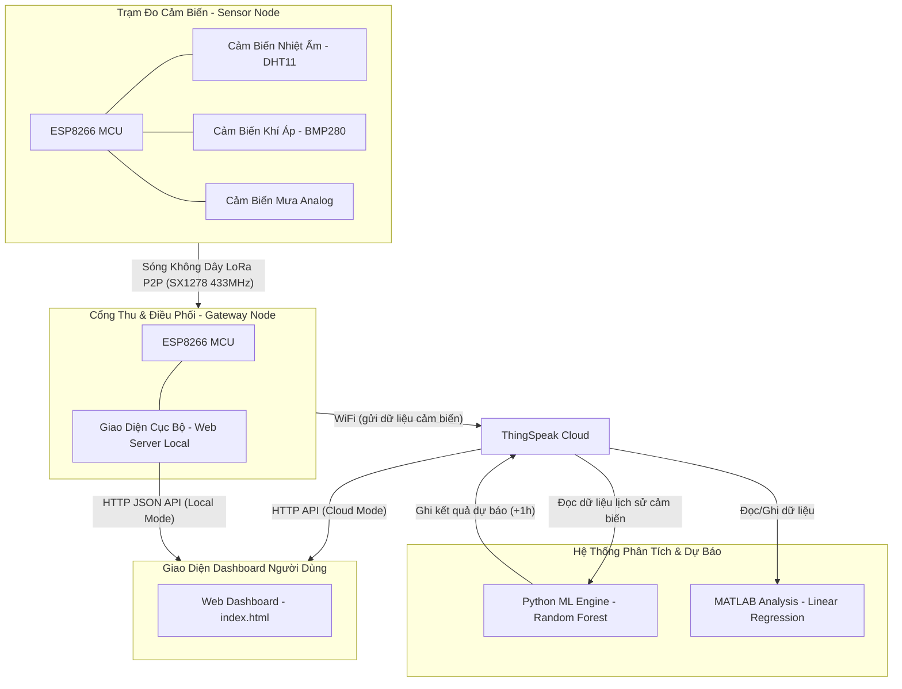

# 🌦️ Smart Weather Station IoT - Trạm Khí Tượng LoRa P2P & Dự Báo Thời Tiết AI

Dự án nghiên cứu và triển khai hệ thống **Trạm quan trắc khí tượng thông minh (Smart Weather Station)** ứng dụng kết nối không dây tầm xa **LoRa P2P (Peer-to-Peer)**, tích hợp cổng **Gateway Cloud (ThingSpeak)** và mô hình dự báo thời tiết bằng trí tuệ nhân tạo **AI (Random Forest)** chạy tự động qua **GitHub Actions**.

Dự án cung cấp giao diện theo dõi trực quan dạng **Web Dashboard (HTML/CSS/JS thuần)** hỗ trợ hai luồng thu thập dữ liệu song song: truy xuất trực tiếp từ Gateway nội bộ (Local) hoặc thông qua Cloud ThingSpeak.

---

## 📌 Sơ Đồ Kiến Trúc Hệ Thống (Architecture)



---

## 🚀 Các Tính Năng Nổi Bật

1. **Truyền dẫn không dây công suất thấp (LoRa P2P)**:
   - Sử dụng IC SX1278 (băng tần 433MHz) truyền dữ liệu nhị phân nén chặt (15-byte Payload).
   - Cơ chế bảo mật và lọc nhiễu qua Sync Word (`0xAB`).
   - Tối ưu hóa năng lượng trạm đo bằng chế độ ngủ sâu **Deep Sleep** (60 giây), tự động điều chỉnh chỉ số thu phát dựa trên độ suy hao tín hiệu thực tế.
2. **Cổng Gateway Đa Nhiệm (Dual-Mode Access Point & Station)**:
   - Vừa làm trạm phát sóng WiFi AP nội bộ cho người dùng kết nối trực tiếp, vừa tự động kết nối vào WiFi trạm để đẩy dữ liệu lên Cloud ThingSpeak.
   - Cung cấp API nội bộ `/data` dạng định dạng JSON chuẩn.
3. **Mô hình Trí Tuệ Nhân Tạo Dự Báo Thời Tiết (AI Engine)**:
   - **Mô hình Random Forest (Python)**: Được huấn luyện dựa trên **3 năm dữ liệu lịch sử thời tiết thực tế tại TP. Hồ Chí Minh (khí hậu 2 mùa: khô/mưa)** lấy từ API Open-Meteo, tự động phân loại trạng thái thời tiết (Nắng ráo, Nhiều mây, Mưa dông) và dự báo nhiệt độ, độ ẩm sau 1 giờ. **Độ chính xác đạt: Nhiệt độ MAE ≤ 0.4°C, Độ ẩm MAE ≤ 2.4%, Phân loại thời tiết Accuracy ≈ 88%.**
   - **GitHub Actions Integration**: Quy trình dự báo chạy tự động **mỗi 15 phút** trên GitHub Runner bằng cách gọi mô hình học máy đã huấn luyện sẵn và ghi kết quả ngược lại ThingSpeak — đồng bộ với chu kỳ MATLAB Analysis.
   - **MATLAB Analysis (Hồi quy tuyến tính)**: Thiết lập dự phòng trực tiếp trên nền tảng ThingSpeak để dự toán nhiệt độ và xu hướng áp suất nếu mô hình AI Python ngoại tuyến.
4. **Dashboard Hiện Đại & Trực Quan (HTML/CSS/JS thuần & SVG Chart)**:
   - Hỗ trợ chế độ màu tối (Dark Mode), hiệu ứng kính mờ (Glassmorphism), biểu đồ thời gian thực dạng SVG tự thân vẽ siêu nhẹ không phụ thuộc thư viện bên ngoài.
   - Đưa ra những cảnh báo canh tác thông minh dựa trên xu hướng thay đổi nhiệt-ẩm cục bộ phục vụ thiết thực cho tưới tiêu, nông nghiệp Việt Nam (ví dụ: phòng ngập úng sầu riêng, bệnh rỉ sắt trên cà phê).

---

## 📂 Cấu Trúc Thư Mục Dự Án (Project Structure)

```text
├── .github/workflows/       # Cấu hình GitHub Actions tự động chạy AI (predict.yml)
├── data/                    # Chứa tệp dữ liệu huấn luyện lịch sử và dashboard HTML tĩnh
│   ├── historical_weather.csv
│   └── viewWeatherStation.html
├── gateway_node/            # Mã nguồn Arduino (C++) cho Trạm Gateway thu nhận dữ liệu
│   ├── gateway_node.ino
│   └── weather_html.h
├── sensor_node/             # Mã nguồn Arduino (C++) cho Trạm Phát cảm biến đầu cuối
│   └── sensor_node.ino
├── ml_engine/               # Mã nguồn máy học (Python) phân tích khí tượng
│   ├── train.py             # Huấn luyện mô hình Random Forest từ API thời tiết lịch sử
│   ├── predict_live.py      # Lấy dữ liệu thực tế, tính toán đặc trưng trễ, dự báo và cập nhật
│   └── requirements.txt     # Danh sách thư viện Python phụ thuộc
├── models/                  # Lưu trữ các file mô hình máy học đã huấn luyện (.joblib)
├── index.html               # Web Dashboard chính (chạy trực tiếp không cần server)
└── compile_html.py          # Script Python đóng gói giao diện mẫu sang file header C++ và index.html
```

---

## 🛠️ Hướng Dẫn Cài Đặt & Chạy Dự Án (Quickstart)

### 1. Chạy Web Dashboard (HTML/CSS/JS thuần)
Giao diện được thiết kế hoàn toàn bằng HTML/CSS/JS thuần và hoạt động độc lập (offline-ready).
- Bạn chỉ cần nhấp đúp vào file `index.html` ở thư mục gốc để mở Dashboard trong trình duyệt.
- Nếu bạn có chỉnh sửa giao diện trong tệp mẫu `data/viewWeatherStation.html`, hãy chạy script sau để đồng bộ ra file `index.html` chính và file header nạp ESP8266:
```bash
python compile_html.py
```

### 2. Sử dụng Mô Hình Máy Học Python (ML Engine)
Đảm bảo bạn đã cài đặt [Python 3.10+](https://www.python.org/).
```bash
# Cài đặt các thư viện cần thiết (numpy, pandas, scikit-learn, requests, joblib)
pip install -r ml_engine/requirements.txt

# Dự báo thời tiết thực tế (script tự động lấy dữ liệu từ ThingSpeak và cập nhật kết quả AI)
python ml_engine/predict_live.py
```

### 3. Nạp Phần Cứng (ESP8266 & LoRa)
Sử dụng công cụ **Arduino IDE** để nạp chương trình:
- Thư viện bắt buộc: `DHT sensor library`, `Adafruit BMP280 Library`, `LoRa` (bởi Sandeep Mistry).
- Điền thông tin WiFi gia đình và API Write Key của ThingSpeak vào [gateway_node.ino](file:///c:/Users/Lenovo/OneDrive/Documents/Study_Materials/FPTU_Syllabus/Sem4/IoT102t-Internet%20of%20Things/weatherStation/gateway_node/gateway_node.ino) trước khi tiến hành nạp.

---

## 📊 Bản Đồ Cấu Hình Các Trường ThingSpeak (Channel Fields)

Để hệ thống hoạt động ổn định nhất, hãy cấu hình các trường (Fields) trên ThingSpeak Channel trùng khớp như sau:

| Trường (Field) | Ý Nghĩa Dữ Liệu | Nguồn Ghi (Source) |
| :--- | :--- | :--- |
| **Field 1** | Nhiệt độ thực tế (°C) | Gateway Node (Sensor) |
| **Field 2** | Độ ẩm thực tế (%) | Gateway Node (Sensor) |
| **Field 3** | Khí áp thực tế (hPa) | Gateway Node (Sensor) |
| **Field 4** | Cảm biến mưa (Giá trị Analog: 0 - 1023) | Gateway Node (Sensor) |
| **Field 5** | Dung lượng Pin trạm phát (%) | Gateway Node (Sensor) |
| **Field 6** | Dự báo nhiệt độ chu kỳ tới (°C) | Python AI / MATLAB |
| **Field 7** | Xác suất mưa dự đoán (%) | Python AI / MATLAB |
| **Field 8** | Dự báo độ ẩm chu kỳ tới (%) | Python AI / MATLAB |

---

## 📜 Giấy Phép & Bản Quyền

Dự án này phục vụ cho mục đích học tập, nghiên cứu môn học **IoT102t (Internet of Things)** tại trường Đại học FPT. Bản quyền thuộc về các thành viên phát triển dự án. Mọi hình thức sao chép vui lòng trích dẫn nguồn đầy đủ.
